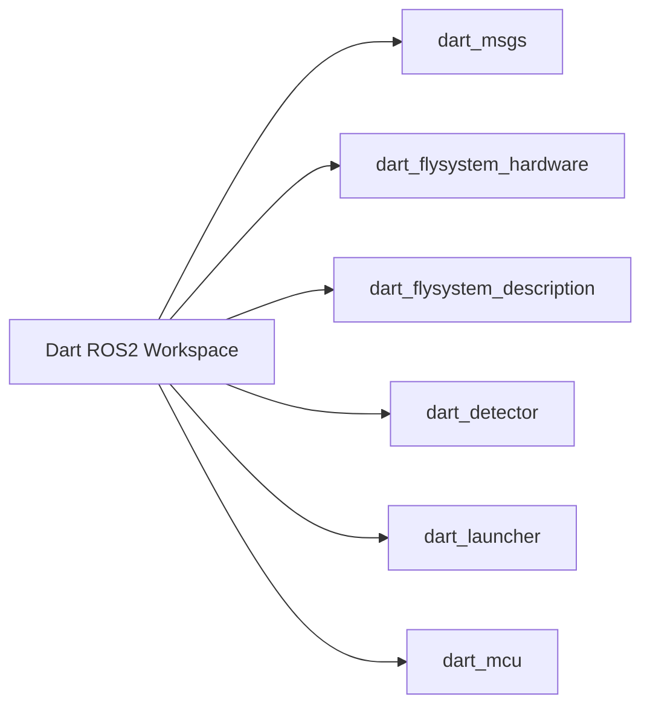
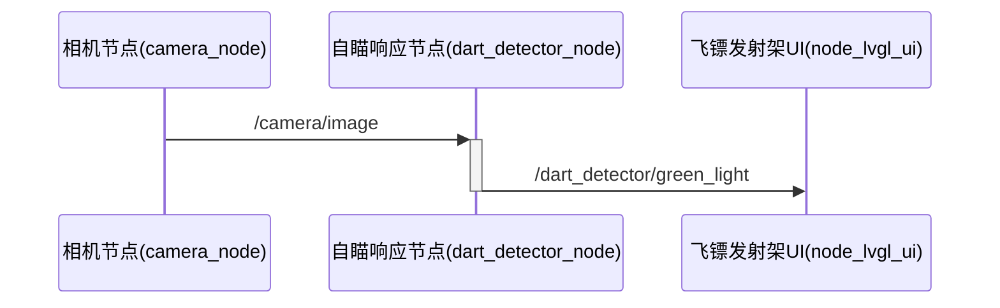
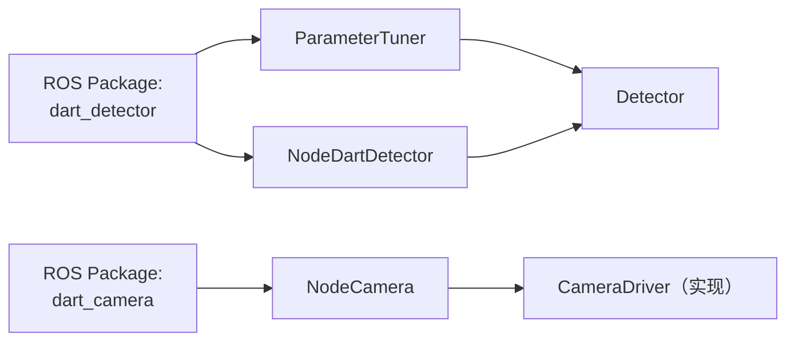
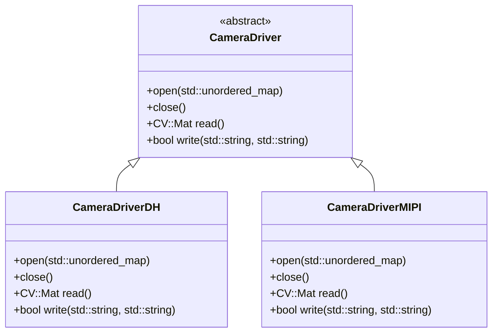
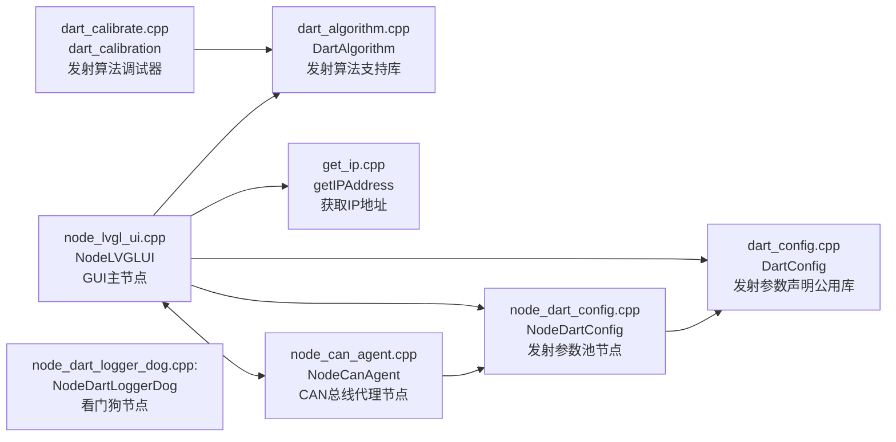
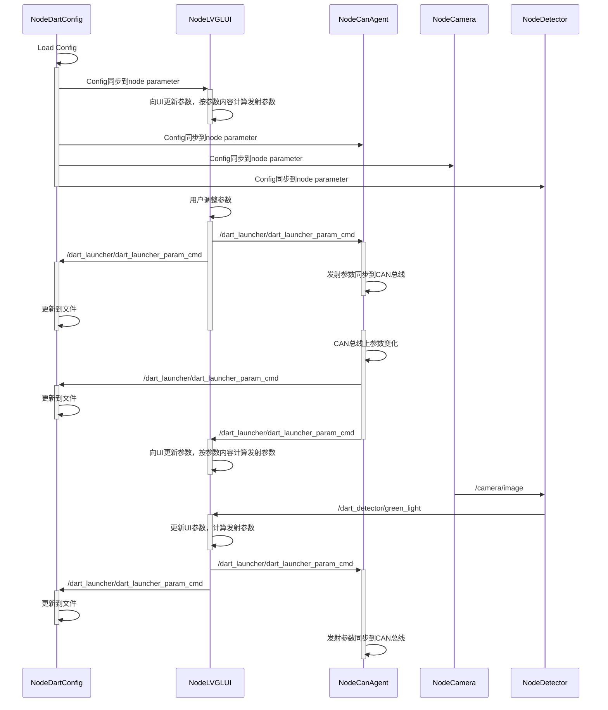
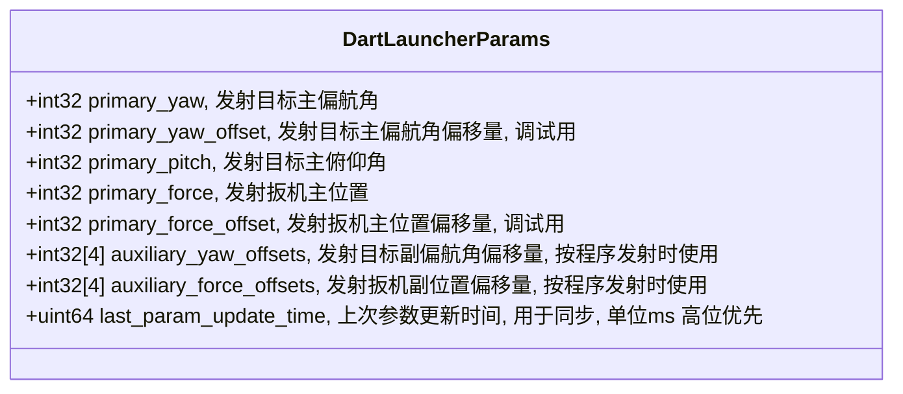
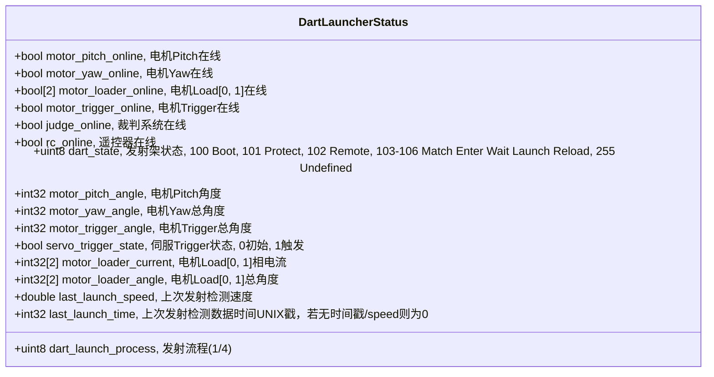
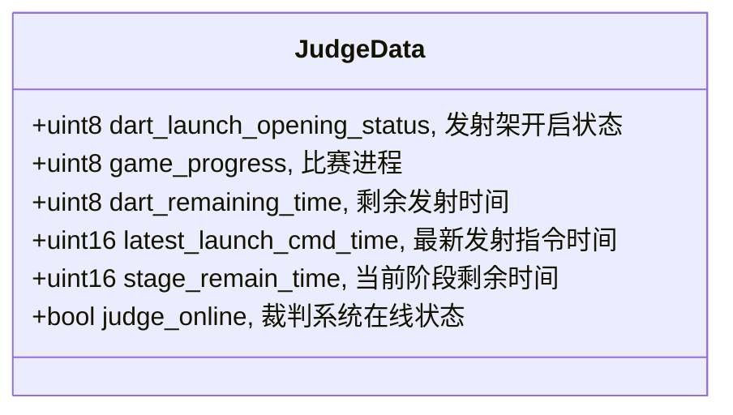
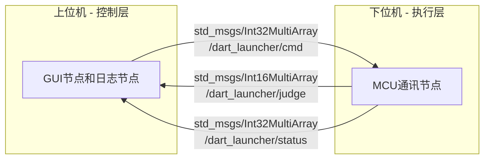

# 飞镖ROS工作空间
> 本工作空间是飞镖机器人的**ROS**工作空间，包含了飞镖机器人的所有ROS功能包。

> 目前工作流依赖`Github Pull Request`，需要**fork**仓库之后向上游提交pull request。



## 自瞄支持包(dart_detector)
> 自瞄支持包是飞镖机器人的自瞄功能的ROS功能包，可以检测目标绿灯，并且计算目标的屏幕坐标。

其通信协议如下(ROS msg格式)：

/dart_msgs/**GreenLight.msg**
``` protobuf
std_msgs/Header header
bool is_detected
geometry_msgs/Point location
```

通讯时序图如下：


注意，自瞄支持包使用的是**OpenCV**库，需要自行编译安装。

/camera/image是飞镖机器人的相机节点(camera_node)，来源为大华工业相机SDK。

/camera/image的消息通过**cv_bridge**与**OpenCV**的**Mat**类型进行互转，然后进行目标检测。

飞镖架上使用的相机不需要更换，但是飞镖上的相机为MIPI接口，需要自行编写驱动，通过**v4l2**接口获取图像。

自瞄支持包内的**Parameter.cpp**可以编译为可执行文件，用于导入数据集，调试自瞄算法的参数。详参[Parameter.cpp](src/dart_detector/src/Parameters.cpp)。

### 重构RoadMap
1. 把**Parameter.cpp**的功能整合到**dart_detector**包内，可以通过ros2 run一键调用调参软件。
2. 把Detector和Camera分开，增加一个Camera的功能包，用于支持多种相机。
2. 引入多种驱动，支持多种相机，多种架构(ARM/x86)。
3. 需要一些测试用例，用于测试系统的稳定性。
4. 添加(主要是制导镖的)相机的参数同步功能。
5. 引入生命周期(ROS2 Lifecycle)控制。

### 重构后的架构

> 注意，这里的CameraDriver是一个基类的实现，需要使用pluginlib编写插件，用于支持不同的相机。


## 飞镖架发射控制包(dart_launcher)
> 飞镖架发射控制包是飞镖机器人的发射控制功能的ROS功能包。主要功能是飞镖架的上位机控制和发射参数池的维护。内置非线性回归机器学习算法(依赖于GSL库)，可以由参数数据集拟合出合适的发射参数，可以通过LVGL UI界面调用/调整发射参数。

dart24版本最终架构图如下：


GUI更新是在node_lvgl_ui.cpp中，按照定时器触发的方式，由LVGL库绘制画布并刷新/dev/fb0，同时获取触摸屏的输入。根据触发的事件，调用其他节点的服务，完成发射参数的调整。

通信格式如下：
/dart_msgs/**DartLauncherStatus.msg**
``` protobuf
std_msgs/Header header
bool motor_ls_online 0
bool motor_y_online 0
bool motor_dm_online 0
bool judge_online 0
bool[4] motor_fw_online [0,0,0,0]
bool rc_online 0
bool dart_launcher_online 0

uint8 dart_state 255 # boot = 100, protect = 101, remote = 102, match = 103-106 Enter Wait Launch Reload, undefined=255

bool motor_y_resetting 0
bool motor_dm_resetting 0
bool motor_ls_resetting 0

uint8 dart_launch_process 0

int32 motor_y_angle 0
int32[4] motor_fw_velocity [0,0,0,0]
float64[4] motor_fw_current [0,0,0,0]

float64[4] bus_voltage [0,0,0,0]
```
/dart_msgs/**DartParam.msg**
``` protobuf
std_msgs/Header header
int32 target_yaw_angle 0
int32 target_yaw_angle_offset 0 # Debug mode only
int32 target_fw_velocity 0
int32 target_fw_velocity_offset 0 # Debug mode only
float64 target_fw_velocity_ratio 0
int32[4] target_yaw_launch_angle_offset [0, 0, 0, 0]
int32[4] target_fw_velocity_launch_offset [0, 0, 0, 0]
bool auto_yaw_calibration 0
bool auto_fw_calibration 0
float64 target_yaw_x_axis 640.0
float64 target_distance 0.0
float64 target_delta_height 0.42
string[4] dart_selection ['Default', 'Default', 'Default', 'Default']
```
/dart_msgs/**Judge.msg** 裁判系统数据包
``` protobuf
std_msgs/Header header
uint8 dart_launch_opening_status
uint8 game_progress
uint8 dart_remaining_time
uint16 latest_launch_cmd_time
uint16 stage_remain_time
bool judge_online
```
具体订阅关系图，请参考RQT图。
打开方式，执行ros2 launch dart_launcher dart.launch.py之后，打开rqt，选择topic，然后选择dart_launcher，即可看到所有的订阅关系。

### 重构RoadMap
1. 增加BLE通信功能，用于与待发射的飞镖进行通信，通知飞镖校准陀螺仪、启动发动机，进入发射程序。
2. 针对拉簧飞镖制式，设计新的UI，修改发射参数池的内容，将摩擦轮转速参数改为扳机位置参数。
3. 重构config的数据流，把飞镖参数池和发射参数池分开，加入发射参数的存档功能。
4. 针对下位机切换为MicroROS，需要重新设计该包的数据流，简少维护压力。
5. 引入生命周期(ROS2 Lifecycle)控制。
6. 改进抛物线预测算法。他还不太准。

### 重构数据流
#### 最重要的是这个**Config Manager**的重新编写。写得好是可以拿来给开源社区用的。
首先，分析之前的数据流。


抽象出新的拉簧发射架发射控制应用层的参数如下：


拉簧发射架状态回传数据如下：


构建传输层的数据结构如下：
基于 `std_msgs/Int32MultiArray` 的定义方案，通过约定数组中各元素的含义，将所有参数打包到一个 `int32` 数组中。假设数组总长度为 14，每个索引代表的参数定义如下：

| 数组索引 | 参数名称                              | 说明                                                         |
|----------|---------------------------------------|--------------------------------------------------------------|
| 0        | `primary_yaw`                    | 发射目标主偏航角                                             |
| 1        | `primary_yaw_offset`             | 发射目标主偏航角偏移量（调试用）                              |
| 2        | `primary_force`                        | 发射扳机主位置                                               |
| 3        | `primary_force_offset`                 | 发射扳机主位置偏移量（调试用）                                |
| 4 ~ 7    | `auxiliary_yaw_offsets[0..3]`| 发射目标副偏航角偏移量（程序发射时使用，共 4 个数值）           |
| 8 ~ 11   | `auxiliary_yaw_offsets[0..3]`     | 发射扳机副位置偏移量（程序发射时使用，共 4 个数值）             |
| 12       | `last_launch_speed`                   | 上次发射检测速度，按一定精度转换成 int32：`int32_value = (int32)(last_launch_speed * 1000)`   |
| 13       | `last_launch_time`                    | 上次发射检测数据时间（UNIX 时间戳，单位：秒）                         |

与此同时，由于裁判系统串口连接到STM32上，需要将裁判系统的数据包转发到ROS2系统中，以便日志记录和其他功能的实现。

裁判系统上行链路数据包定义如下：


裁判系统数据包的传输方案与发射参数传输方案类似，但为了减少数据包的传输量，使用 `std_msgs/Int16MultiArray` 执行数据传输。数组总长度为 6，每个索引代表的参数定义如下：

| 数组索引 | 参数名称                              | 说明                                                         |
|----------|---------------------------------------|--------------------------------------------------------------|
| 0        | `dart_launch_opening_status`       | 发射架开启状态                                               |
| 1        | `game_progress`                    | 比赛进程                                                     |
| 2       | `dart_remaining_time`              | 剩余发射时间                                                 |
| 3       | `latest_launch_cmd_time`           | 最新发射指令时间                                             |
| 4       | `stage_remain_time`                | 当前阶段剩余时间                                             |
| 5       | `judge_online`                     | 裁判系统在线状态                                             |

框图如下：

