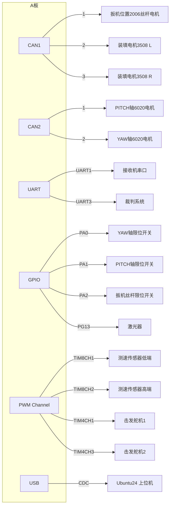

# 飞镖架电气拓扑


# 飞镖架程序状态机
```cpp
OpenFSM::RegisterAction<ActionWaitForAllMotorOnline>("ActionWaitForAllMotorOnline");
OpenFSM::RegisterAction<ActionResetMotors>("ActionResetMotors");
OpenFSM::RegisterAction<ActionProtect>("ActionProtect");
OpenFSM::RegisterAction<ActionRemote>("ActionRemote");
OpenFSM::RegisterAction<ActionMatch_Enter>("ActionMatch_Enter");
OpenFSM::RegisterAction<ActionMatch_Wait>("ActionMatch_Wait");
OpenFSM::RegisterAction<ActionMatch_Launch>("ActionMatch_Launch");
OpenFSM::RegisterAction<ActionMatch_Reload>("ActionMatch_Reload");

OpenFSM::RegisterState("StateBoot", {"ActionWaitForAllMotorOnline", "ActionResetMotors"},
                        E_Dart_State::Boot);
OpenFSM::RegisterState("StateProtect", {"ActionProtect"}, E_Dart_State::Protect);
OpenFSM::RegisterState("StateRemote", {"ActionRemote"}, E_Dart_State::Remote);
OpenFSM::RegisterState("StateMatch", {"ActionMatch_Enter", "ActionMatch_Wait", "ActionMatch_Launch",
                                        "ActionMatch_Reload", "ActionMatch_Wait", "ActionMatch_Launch",
                                        "ActionMatch_Reload", "ActionMatch_Wait", "ActionMatch_Launch",
                                        "ActionMatch_Reload"},
                        E_Dart_State::Match);

OpenFSM::RegisterRelation("StateBoot", {"StateProtect"});
OpenFSM::RegisterRelation("StateProtect", {"StateRemote", "StateMatch"});
OpenFSM::RegisterRelation("StateRemote", {"StateProtect", "StateMatch"});
OpenFSM::RegisterRelation("StateMatch", {"StateProtect", "StateRemote"});
```